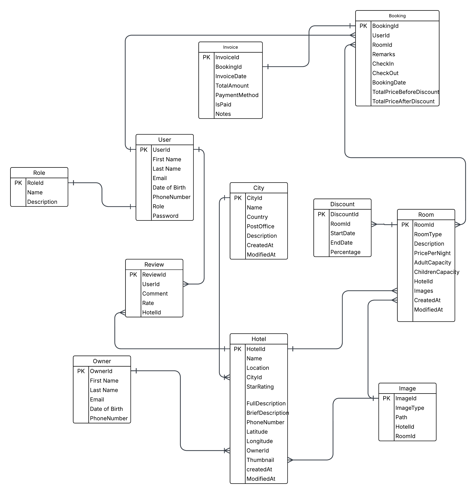

# 🧳 Travel and Accommodation Booking Platform

## ✨ Overview

This is a comprehensive **Travel and Accommodation Booking Platform** designed with **Clean Architecture** principles. It provides robust APIs that support a variety of essential functionalities such as:

- User authentication (JWT-based)
- Hotel search and listing
- Booking management
- Hotel and room management
- Admin operations
- Secure checkout
- Reviews and ratings

This project is ideal for demonstrating advanced API design, domain separation, and enterprise-level practices in ASP.NET Core.

---

## 🧱 Tech Stack

| Layer         | Technology |
|---------------|------------|
| Backend       | ASP.NET Core 9 (Web API) |
| ORM           | Entity Framework Core 9 |
| Database      | SQL Server |
| Auth          | JWT Bearer Authentication |
| Validation    | FluentValidation |
| Object Mapping| AutoMapper |
| Logging       | Serilog (Console & File sinks) |
| Filtering     | Sieve |
| Email Service | MailKit |
| Reporting     | NReco.PdfGenerator |
| Testing       | xUnit, Moq, AutoFixture |

---

## 🧭 Architecture

This project follows **Clean Architecture**, which provides a separation of concerns through layered structuring:

- `Core`: Entities, interfaces, and shared models.
- `Application`: Business logic, DTOs, validators, services.
- `Infrastructure`: Database, external services, and persistence.
- `WebAPI`: Presentation layer exposing RESTful APIs.

---

## 🛠️ Prerequisites

To run this project locally:

- [.NET 9 SDK](https://dotnet.microsoft.com/download/dotnet/9.0)
- [SQL Server](https://www.microsoft.com/en-us/sql-server/sql-server-downloads)
- Visual Studio 2022+ or CLI

---

## 🚀 Running the App

1. **Clone the repository**:
   ```bash
   git clone https://github.com/aya-baara/TravelAndAccommodationBooking
   cd BookingPlatform
   ```

2. **Configure the connection string** in `appsettings.json` under the `WebAPI` project:
   ```json
   "ConnectionStrings": {
     "DefaultConnection": "Server=.;Database=BookingPlatformDb;Trusted_Connection=True;MultipleActiveResultSets=true"
   }
   ```

3. **Apply Migrations**:
   ```bash
   dotnet ef database update --project BookingPlatform.Infrastructure
   ```

4. **Run the application** (WebAPI only):
   ```bash
   dotnet run --project BookingPlatform.WebAPI
   ```

5. **Browse to Swagger UI**:
   ```
   https://localhost:<port>/swagger
   ```

---

## 🧪 Running Tests

The project includes unit tests using:

- xUnit
- Moq
- AutoFixture
- FluentAssertions

To run tests:

- **Via Visual Studio**: Right-click `BookingPlatform.Tests` > Run Tests
- **Via CLI**:
   ```bash
   dotnet test BookingPlatform.Tests
   ```

---

## 📚 API Documentation

Swagger UI is enabled by default. After running the project, navigate to:

```
https://localhost:<port>/swagger
```
**Bookings**
HTTP Method | Endpoint                         | Description
------------|----------------------------------|-------------------------------
POST        | /api/bookings               | Create a new Booking
DELETE      | /api/bookings/{id}          | Delete a booking by ID
GET         | /api/bookings/{id}          | Get booking details by ID
GET         | /api/bookings/recent-hotels | Get recently booked hotels for the authenticated user.

**Cities**

| HTTP Method | Endpoint               | Description                                                   |
|-------------|------------------------|---------------------------------------------------------------|
| POST        | /api/cities            | Create a new city                                             |
| PUT         | /api/cities            | Update an existing city                                       |
| DELETE      | /api/cities/{id}       | Delete a city by ID                                           |
| GET         | /api/cities/{id}       | Get city details by ID (public)                               |
| GET         | /api/cities/top/{num}  | Get top N most visited cities (public)                        |
| GET         | /api/cities/search     | Search cities with filters, sorting, and pagination (admin only) |

**Discounts**

| HTTP Method | Endpoint                    | Description                                                   |
|-------------|-----------------------------|---------------------------------------------------------------|
| POST        | /api/discounts              | Create a new discount for a room (admin only)                |
| GET         | /api/discounts/{id}         | Get discount details by ID (authenticated users)             |
| GET         | /api/discounts/room/{roomId}| Get all discounts for a specific room (authenticated users)  |
| PUT         | /api/discounts              | Update an existing discount (admin only)                     |
| DELETE      | /api/discounts/{id}         | Delete a discount by ID (admin only)                         |

**Hotels**

| HTTP Method | Endpoint                 | Description                                                               |
|-------------|--------------------------|---------------------------------------------------------------------------|
| POST        | /api/hotels              | Create a new hotel (admin only)                                           |
| GET         | /api/hotels/{id}         | Get hotel details by ID, including images and reviews (public)           |
| GET         | /api/hotels/search       | Search hotels with filters and pagination (public)                        |
| GET         | /api/hotels/admin        | Search hotels for admin with filters and pagination (admin only)         |
| GET         | /api/hotels/featured     | Get a list of featured hotel deals (public)                               |
| PUT         | /api/hotels              | Update a hotel (admin only)                                               |
| DELETE      | /api/hotels/{id}         | Delete a hotel by ID (admin only)                                         |

**Images**

| HTTP Method | Endpoint           | Description                                             |
|-------------|--------------------|---------------------------------------------------------|
| POST        | /api/images        | Create a new image for a hotel or room (admin only)    |
| GET         | /api/images/{id}   | Get an image by ID (admin only)                        |
| PUT         | /api/images        | Update an existing image (admin only)                  |
| DELETE      | /api/images/{id}   | Delete an image by ID (admin only)                     |

**Invoices**

| HTTP Method | Endpoint                                          | Description                                                             |
|-------------|---------------------------------------------------|-------------------------------------------------------------------------|
| POST        | /api/bookings/{bookingId}/invoices               | Create a new invoice for a booking (admin only)                        |
| GET         | /api/bookings/{bookingId}/invoices               | Get invoice by booking ID (admin only)                                 |
| PUT         | /api/bookings/{bookingId}/invoices               | Update an existing invoice (admin only)                                |
| DELETE      | /api/bookings/{bookingId}/invoices               | Delete an invoice by booking ID (admin only)                           |
| GET         | /api/bookings/{bookingId}/invoices/print         | Generate and download a PDF invoice (authenticated user)               |

**Owners**

| HTTP Method | Endpoint           | Description                                        |
|-------------|--------------------|----------------------------------------------------|
| POST        | /api/owners        | Create a new owner (admin only)                   |
| PUT         | /api/owners        | Update an existing owner (admin only)             |
| DELETE      | /api/owners/{id}   | Delete an owner by ID (admin only)                |
| GET         | /api/owners/{id}   | Get owner details by ID (admin only)              |

**Reviews**

| HTTP Method | Endpoint                                         | Description                                                          |
|-------------|--------------------------------------------------|----------------------------------------------------------------------|
| POST        | /api/hotels/{hotelId}/reviews                   | Create a new review for a hotel (authenticated user)                |
| GET         | /api/hotels/{hotelId}/reviews/{reviewId}        | Get a specific review by ID                                         |
| GET         | /api/hotels/{hotelId}/reviews                   | Get all reviews for a hotel (paginated)                             |
| PUT         | /api/hotels/{hotelId}/reviews/{reviewId}        | Update a review by ID (authenticated user and owner of the review)  |
| DELETE      | /api/hotels/{hotelId}/reviews/{reviewId}        | Delete a review by ID (authenticated user and owner of the review)  |

**Roles**

| HTTP Method | Endpoint                        | Description                                                |
|-------------|----------------------------------|------------------------------------------------------------|
| POST        | /api/roles                       | Create a new role (admin only)                             |
| GET         | /api/roles/{id}                  | Get role details by ID (admin only)                        |
| GET         | /api/roles/by-type/{roleType}    | Get role details by role type enum (admin only)            |
| DELETE      | /api/roles/{id}                  | Delete a role by ID (admin only)                           |

**Rooms**

| Method | Endpoint                             | Description                          |
|--------|------------------------------------|----------------------------------------|
| POST   | /api/rooms                         | Create a new room (admin only)         |
| PUT    | /api/rooms                         | Update an existing room  (admin only)  |
| DELETE | /api/rooms/{id}                    | Delete a room by ID (admin only)       |
| GET    | /api/rooms/{id}                    | Get a room by ID                       |
| GET    | /api/rooms/hotel/{hotelId}/available | Get available rooms for a hotel      |
| GET    | /api/rooms/admin                   | Search rooms with filters (admin only) |

**Users**

| Method | Endpoint      | Description                 |
|--------|---------------|-----------------------------|
| POST   | /api/users/signup | Register a new user          |
| POST   | /api/users/login  | Authenticate user & get JWT |


---

## 🗂 Folder Structure

```
BookingPlatform/
├── BookingPlatform.Core/         # Domain entities and interfaces
├── BookingPlatform.Application/  # Business logic, services, DTOs
├── BookingPlatform.Infrastructure/ # EF Core, external services (Email, PDF)
├── BookingPlatform.WebAPI/       # API layer, controllers
├── BookingPlatform.Tests/        # Unit tests (xUnit + Moq + AutoFixture)
```

---

## 🔒 Authentication & Authorization

- Uses **JWT Tokens**
- Supports roles: `User`, `Admin`, `Owner`
- Role-based access via `[Authorize(Roles = "Admin")]`

---

## 📧 Features

- 📬 **Email confirmations** via MailKit
- 🧾 **PDF booking receipts** via NReco
- 🎯 **Filtering, Sorting, Paging** using Sieve
- 🛡️ **Secure APIs** with layered validation

---
## Database Schema
Below is the Entity-Relationship Diagram (ERD) illustrating the structure of the database, including tables, relationships, and keys used in the application.




## 👩‍💻 Author

Built by Aya Ba'ara  
Backend training by Footill Technology

---

## 📜 License

This project is licensed under the MIT License.
